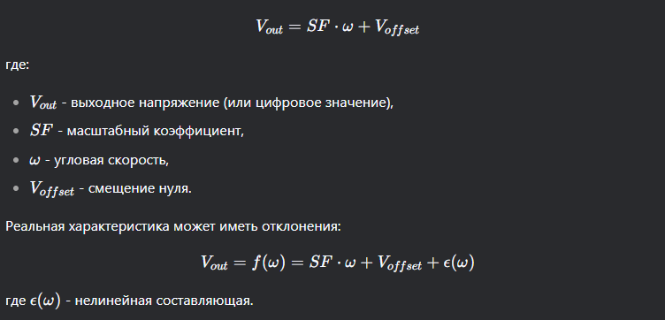

## Общие параметры работы программы
### Config
Файл config.py позволяет вводить глобальные переменные, 
которые взаимодействуют с входными данными всей программы. 
Ниже представлено описание параметров файла конфигурации:

`file_path_dreif` - путь к файлу расширения dat с данными 
дрейфа МЭМ гироскопа

`file_path_mk` - путь к файлу расширения dat с данными для 
анализа масштабного коэффициента МЭМ гироскопа

### Работа с форматом dat
Первоначально код обрабатывает файлы расширения .dat в
расширение .xlsx для того, чтобы можно было визуально 
проконтролировать ход выполения программы и имеющиеся значения.

> Данный этап работы можно обойти

## Масштабный коэффициент
### Формула расчета масштабного коэффициента
1. Физический смысл масштабного коэффициента
Масштабный коэффициент (Scale Factor, SF) гироскопа показывает, как выходное напряжение (или цифровое значение) связано с реальной угловой скоростью.

Формула:


2. Методика расчёта (на основе кода)
В данном коде используется метод калибровки по известной угловой скорости (в данном случае, -50°/с).

Формула для расчёта МК:


Почему делим на 2?

- Гироскоп колеблется между максимальными положительным
и отрицательным значениями угловой скорости,
поэтому размах сигнала в вольтах соответствует двойной амплитуде

- Чтобы получить чувствительность для одной полярности, делим на 2

Перевод в мВ/(°/с):

В коде результат умножается на 1000 для перевода в милливольты 
(если исходные данные в вольтах).

4. Когда такой метод применим?
- Гироскоп находится в режиме калибровки (вращается с известной скоростью).
- Выходной сигнал линейно зависит от угловой скорости (нет насыщения).
- Нет значительных шумов, искажающих размах сигнала.

5. Ограничения метода
- Требуется точное знание константной угловой скорости
- Не учитывает нелинейности (если гироскоп имеет квадратичную зависимость, нужна более сложная модель)
- Чувствителен к шумам – если в данных есть выбросы, то максимальные и минимальные значения напряжения
могут быть некорректными

### Формула рачета нелинейности
Нелинейность масштабного коэффициента показывает, насколько реальная характеристика гироскопа отклоняется от идеальной линейной зависимости между выходным сигналом и угловой скоростью.
Выражается в процентах от полного диапазона выходного сигнала.

Математическая модель идеальной линейной зависимости:


Формула расчета нелинейности рассчитывается следующим образом:


### Формула рачета несимметричности
Несимметричность масштабного коэффициента (Scale Factor Asymmetry) характеризует различие чувствительности гироскопа при положительных и отрицательных угловых скоростях.
В идеальном случае гироскоп должен одинаково реагировать на вращение в обе стороны.


В данном коде используется альтернативный подход, поскольку измерения проводятся только при одной угловой скорости.
Вместо сравнения разных скоростей анализируется асимметрия отклонений от среднего значения.


Интерпретация результатов
- 0% - идеальная симметрия
- меньше 5% - хороший показатель
- 5-10% - допустимо для большинства применений
- больше 10% - может требовать коррекции или указывать на проблемы датчика

### Формула рачета смещения нуля
Смещение нуля (Zero Offset) - это выходной сигнал гироскопа при нулевой угловой скорости. Обусловлено:

- Внутренними напряжениями в датчике
- Неидеальностью электронных компонентов
- Температурными эффектами


Особенности расчёта
- Требует предварительного определения масштабного коэффициента
- Предполагает, что измерения проводились при нулевой угловой скорости
- Учитывает систематическую ошибку датчика

Ограничения метода
- Чувствителен к низкочастотным шумам
- Не учитывает температурный дрейф
- Требует стабильных условий измерений

## Дрейф гироскопа
### Формула рачета смещения нуля
Смещение нуля производится при помощи вычисления среднего
значения (файл proc_dreif.py, 30):

```python
bias = gyro_data[['GYR_X', 'GYR_Y', 'GYR_Z']].mean()
print("\nСмещение нуля (°/с):")
print(bias)
```
Формулы вычисления смещения нуля в общем виде:


### Формула рачета тренда
Для вычисления тренда используется линейное представление с 
унификацией параметров. Общий вид формулы:


Для каждой из осей X, Y, Z, выполняется аппроксимация
методом наименьших квадратов (`curve_fit`). Скорость дрейфа - 
это коэффициент `a`, который в исходных данных имеет 
размерность °/с^2 (если гироскоп измеряет угловую скорость
в °/с, а время в секундах)

#### Метод наименьших квадратов
Вид формул для реализации метода наименьших квадратов (линейная регрессия):


Ключевые свойства МНК:
- Даёт несмещённые оценки, если ошибки измерений случайны
и нормально распределены
- Минимизирует дисперсию ошибки предсказания
- Применим для линейных и нелинейных моделей

Применение: калибровка датчиков, аппроксимация данных, фильтрация шумов.

### Формула рачета девиации Аллана
Оценить шумы и нестабильность гироскопа (или другого датчика) в зависимости от времени усреднения

1. Основные шаги алгоритма


2. Ключевые формулы в коде

- Количество групп
```python
d = n // m  
# n - общее число точек, m - точек в группе
```

- Средние по группам
```python
group_means = groups.mean(axis=1)  
# shape = (d,)
```

- Разности соседних средних
```python
diffs = np.diff(group_means)  
# shape = (d-1,)
```

- Девиация Аллана
```python
adev[i] = np.sqrt(0.5 * np.mean(diffs ** 2))
```

3. Физический смысл девиации Аллана для гироскопии

- Показывает, как ошибка (белый шум, дрейф, 
фликкер-шум) зависит от времени усреднения

- Минимум на графике соответствует оптимальному времени усреднения.

4. Особенности реализации

Используется логарифмическая шкала для времени усреднения, 
чтобы охватить большой диапазон.

Частота дискретизации нужна для перевода 
времени усреднения в количество точек.

Применение: анализ стабильности гироскопов, акселерометров, атомных часов.

### Формула рачета аппроксимации девиации Аллана
Аппроксимирующая модель включает три основных
источника шума:


В коде используется нелинейный метод наименьших
квадратов (`curve_fit`):
- Модель `allan_variance_model(tau, N, B, K)`
- Начальные приближения `p0=[1e-3, 1e-3, 1e-3]`
- Алгоритм
  - подбирает N, B, K, чтобы минимизировать разницу между ADEF данных и моделью
  - использует логарифмический масштаб для лучшей сходимости
- Причины выбора такой модели:
  - учитывает три основных типа шумов в гироскопах
  - позволяет разделить вклады ARW, Bias Instability, RRW

Аппроксимация ADEV позволяет:
- Количественно оценить шумы гироскопа
- Оптимизировать фильтрацию данных
- Сравнивать характеристики разных датчиков

Применение: калибровка IMU, анализ стабильности, проектирование систем навигации

### Формулы рачета параметров 

1. Rate Random Walk


2. Angular Random Walk


3. Bias Instability
